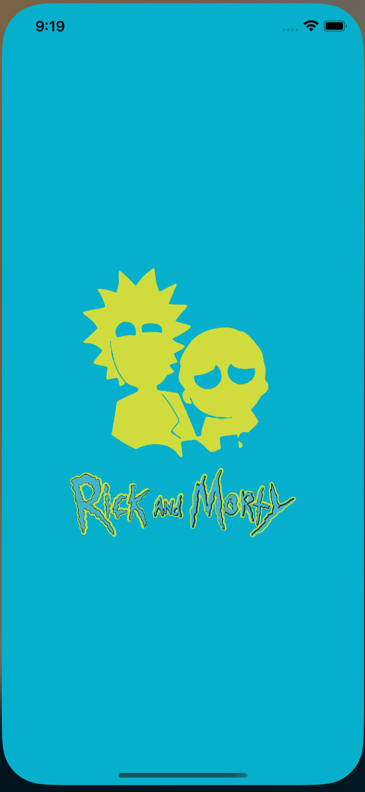
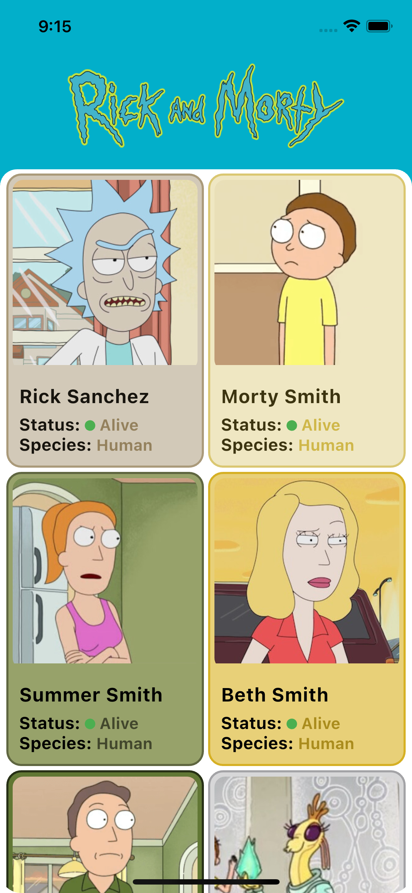
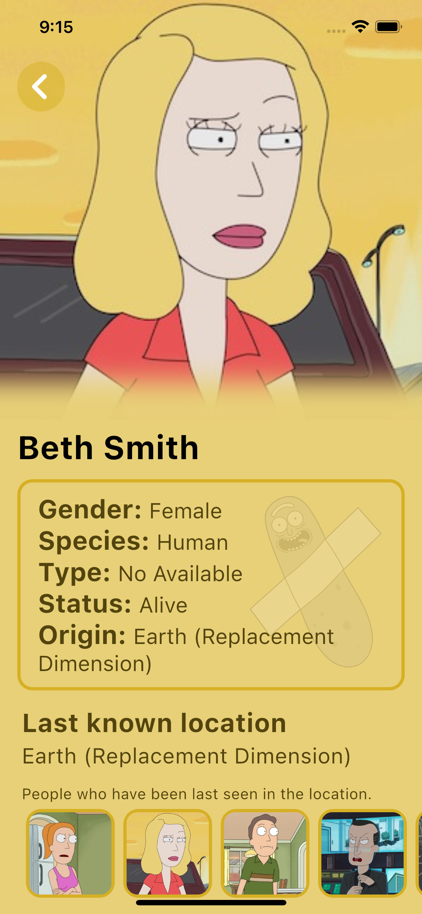
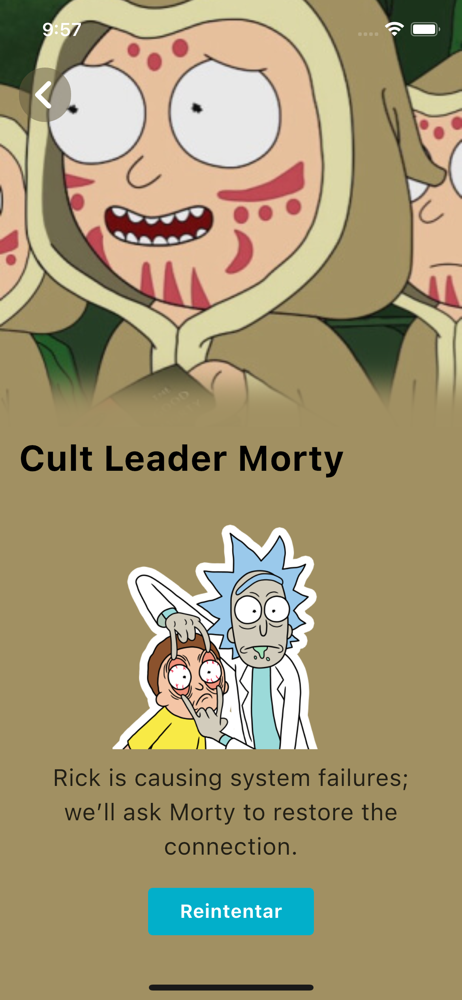
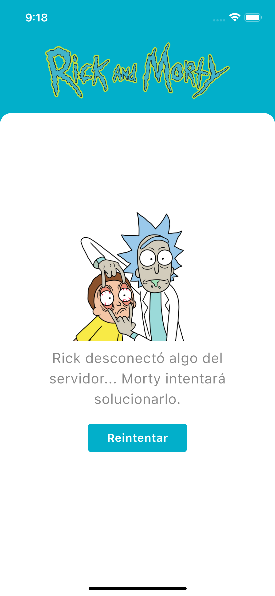

# 🛸 Rick And Morty App

Aplicación desarrollada en Flutter que consume la API pública de Rick and Morty para mostrar información sobre personajes, estado, ubicación, foto, etc.

## 📋 Tabla de Contenidos

- [🛸 Rick And Morty App](#-rick-and-morty-app)
  - [📋 Tabla de Contenidos](#-tabla-de-contenidos)
  - [✨ Características](#-características)
  - [🛠️ Tecnologías Utilizadas](#️-tecnologías-utilizadas)
  - [📁 Estructura del Proyecto](#-estructura-del-proyecto)
  - [🚀 Instalación y Ejecución](#-instalación-y-ejecución)
  - [📸 Pantallas](#-pantallas)
    - [Splash pantalla de carga:](#splash-pantalla-de-carga)
    - [Lista de personajes:](#lista-de-personajes)
    - [Detalle de un personaje:](#detalle-de-un-personaje)
    - [Vista de error en el detalle de un personaje:](#vista-de-error-en-el-detalle-de-un-personaje)
    - [Vista de error en la lista de personajes:](#vista-de-error-en-la-lista-de-personajes)
  - [📄 Licencia](#-licencia)

## ✨ Características

- **Listado de Personajes**: Muestra una lista de personajes obtenidos desde la [API de Rick and Morty](https://rickandmortyapi.com/).
- **Detalles del Personaje**: Muestra mayor detalle de un personaje seleccionado indicando, genero, origen, estado, ubicación, etc.
- **Paginación**: Para cargar mas personajes desplázate hasta el final de la lista
- **Actualizar lista:** Puedes deslizar la lista hacia abajo y la lista actualizará los personajes, cargando los de la siguiente página
## 🛠️ Tecnologías Utilizadas

- **[Flutter](https://flutter.dev/)**: Framework de UI para desarrollar aplicaciones nativas multiplataforma.
- **[Dart](https://dart.dev/)**: Lenguaje de programación utilizado por Flutter.
- **[GraphQl](https://pub.dev/packages/graphql_flutter)**: Paquete de Flutter que permite hacer peticiones a la API de Rick And Morty

## 📁 Estructura del Proyecto

```
fakestore-ecommerce-app/
├── lib/
├── core/                      # Inyección de dependencia, rutas, Configuración Graphql, utilidades.
├── features/
│   ├── characters/            # Visualización de personajes
│   │   ├── data/              # modelos, implementación de repositorio
│   │   ├── domain/            # Casos de uso
│   │   └── presentation/      # Widgets, páginas, controladores
│   ├── character_detail/      # Detalle personaje
│   │   ├── domain/
│   │   └── presentation/
│   └── shared/                # Componentes compartidos entre features
│       ├── data/              # Fuente de datos
│       ├── domain/            # Entidades
│       └── presentation/      # Widgets
└── main.dart                  # Punto de entrada de la app
```

## 🚀 Instalación y Ejecución

Sigue los siguientes pasos para clonar y ejecutar el proyecto en tu entorno local:

1. **Clonar el repositorio**

   ```bash
   git clone https://github.com/Carl0395/rick_and_morty_app.git
   cd rick_and_morty_app
   ```

2. **Instalar dependencias**

   Asegúrate de tener Flutter instalado. Luego, ejecuta:

   ```bash
   flutter pub get
   ```

3. Ejecuta el comando

   ```dart
   dart run build_runner watch -d
   ```
   Para la generación de código de Riverpod
   
4. **Ejecutar la aplicación**

   Para ejecutar la aplicación en un dispositivo o emulador conectado:

   ```bash
   flutter run
   ```

## 📸 Pantallas

### Splash pantalla de carga:



### Lista de personajes:



### Detalle de un personaje:



### Vista de error en el detalle de un personaje:



### Vista de error en la lista de personajes:



Permite crear una cuenta de usuario

## 📄 Licencia

Este proyecto está bajo la licencia MIT. Consulta el archivo [LICENSE](LICENSE) para más detalles.